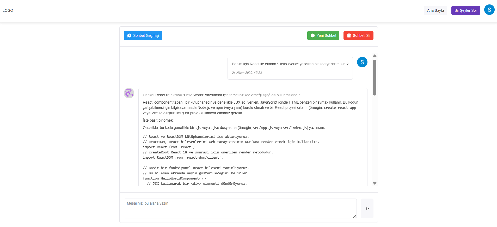

# Chat Bot Uygulaması

Bu proje, Google'ın **Gemini API** servislerini kullanarak geliştirilmiş basit bir sohbet botu (ChatBot) uygulamasıdır. Uygulama, Gemini'nin ücretsiz olarak sunduğu yapay zeka modelleriyle çalışır ve kullanıcıların temel düzeydeki sorularına cevap verebilir.

Uygulamayı kendi bilgisayarınıza indirerek yerel ortamınızda kolayca test edebilirsiniz.



---

## 🚀 Özellikler

- Google Gemini API ile doğal dil işleme
- Firebase Authentication ve Realtime Database entegrasyonu
- Kullanıcı oturumu yönetimi
- Gerçek zamanlı mesajlaşma altyapısı
- Basit ve kullanıcı dostu arayüz

---

## 🔑 Google Gemini API Kurulumu

1. [Gemini API Dokümantasyonu](https://ai.google.dev/gemini-api/docs) sayfasına gidin.
2. Google Cloud hesabınızla giriş yaparak bir proje oluşturun.
3. Projeniz için bir **API anahtarı (API Key)** oluşturun.
4. Bu API anahtarını `.env` dosyanızın içerisine aşağıdaki şekilde ekleyin:

   ```env
   GOOGLE_AI_API_KEY=buraya_sizin_api_key_değeriniz
   ```

5. Farklı model seçeneklerini denemek için **"All Models"** bölümünden istediğiniz modeli seçebilirsiniz.

---

## 🔥 Firebase Yapılandırması

Uygulamada kullanıcı girişi ve veri yönetimi için Firebase kullanılmaktadır.

### Firebase Projesi Oluşturma

1. [Firebase Web Başlangıç Rehberi](https://imselmon.medium.com/firebase-for-web-a-step-by-step-tutorial-bf4da59c0a02) adresinden Firebase projesi oluşturma adımlarını takip edebilirsiniz.
2. Firebase projenizde şu iki özelliği aktif hale getirin:
   - **Authentication** (Google Authentica Aktif olması gerekmekte)
   - **Realtime Database**

### Firebase Ayarlarının Yapılandırılması

Firebase projenize ait konfigürasyon bilgilerini şu klasördeki dosyada güncelleyin:

```
client/src/firebase
```

---

## 📦 Bağımlılıkların Kurulması

Proje iki ana klasörden oluşur:

- `api` (sunucu tarafı)
- `client` (istemci tarafı)

Her iki klasörde de bağımlılıkların yüklenmesi gerekir.

### Kurulum Adımları

Aşağıdaki komutları her klasör içinde ayrı ayrı çalıştırın:

```bash
npm install
```

> **Not:** Bu projenin çalışması için bilgisayarınızda **Node.js 18 veya üzeri** bir sürüm kurulu olmalıdır. Kurulu değilse [nodejs.org](https://nodejs.org/tr) adresinden LTS sürümünü indirerek yükleyebilirsiniz.

---

## ⚙️ Teknolojiler

- **Node.js** – Sunucu tarafı işlemleri
- **Express.js** – API yapısı
- **React** – Ön yüz geliştirme
- **Firebase** – Kimlik doğrulama & veritabanı
- **Google Gemini API** – Yapay zeka desteği

---

## 🧪 Uygulamanın Çalıştırılması

Aşağıdaki adımları takip ederek uygulamayı başlatabilirsiniz:

```bash
# API klasöründe
cd api
npm install
npm start

# Client klasöründe
cd client
npm install
npm start
```

Tarayıcınızda `http://localhost:3000` adresinden uygulamayı görüntüleyebilirsiniz.

---

## 🤝 Katkı Sağlamak

Bu projeye katkıda bulunmak isterseniz:

1. Reponun bir fork'unu oluşturun.
2. Geliştirmelerinizi kendi branch'inizde yapın.
3. Pull Request gönderin.

Görüş ve önerileriniz için issue oluşturabilirsiniz.

---

## 📄 Lisans

Bu proje açık kaynaklıdır ve MIT lisansına sahiptir.
